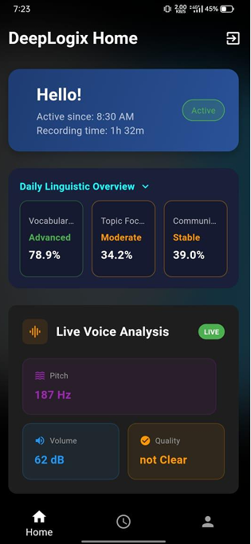
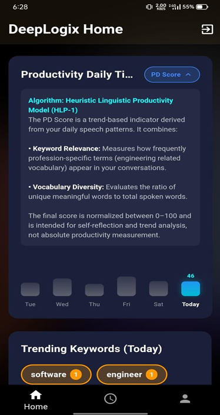
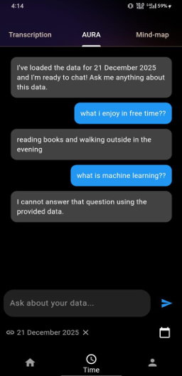
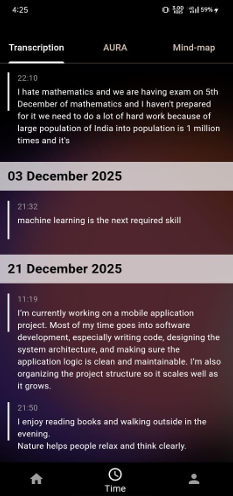
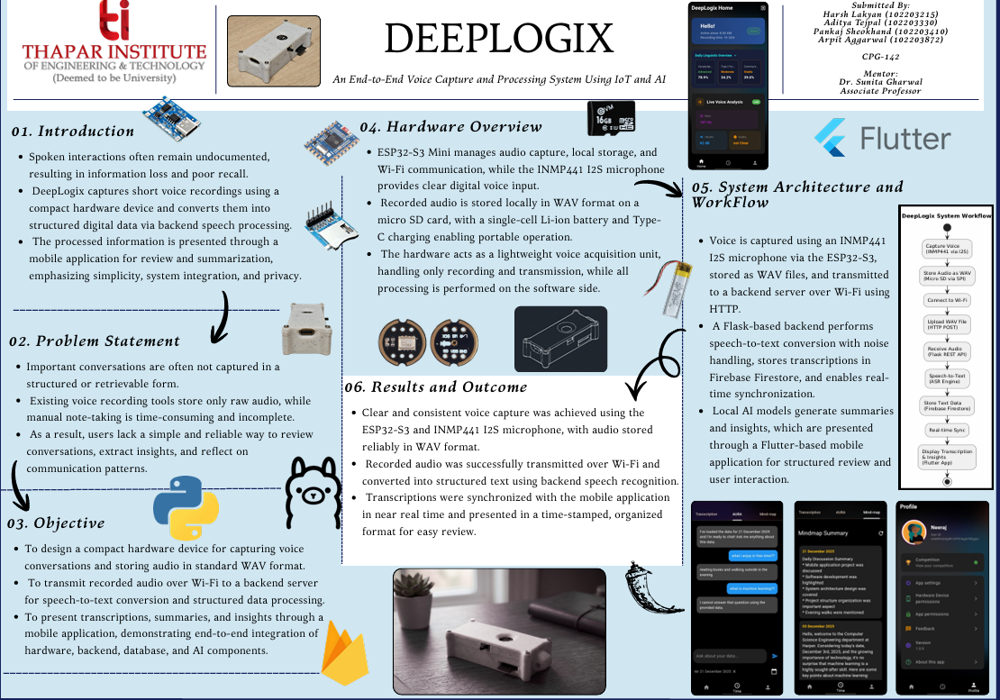

# 🎙️ DeepLogix  
### An End-to-End Voice Capture and Processing System Using IoT and AI

---

## 👨‍💻 Team
- Aditya Tejpal (102203330)  
- Pankaj Sheokhand (102203410)  

**Batch:** CPG-142  
**Mentor:** Dr. Sunita Gharwal (Associate Professor)

---

## 📌 Overview

DeepLogix is a complete voice intelligence system that captures spoken conversations using a compact IoT device and transforms them into structured, meaningful digital insights.

It bridges the gap between raw voice recording and actionable information, enabling users to review, summarize, and reflect on conversations effortlessly.

---

## 🚀 Features

- 🎤 Real-time voice capture using IoT hardware  
- 📡 Wireless transmission via Wi-Fi  
- 🧠 AI-powered speech-to-text conversion  
- 📝 Automatic summaries and insights  
- 📱 Flutter-based mobile interface  
- 🔄 Real-time sync with cloud database  
- 🔒 Privacy-focused design (minimal local processing)

---

## 🧩 Problem Statement

- Conversations are often lost or forgotten  
- Existing tools store only raw audio without structure  

Manual note-taking is:
- Time-consuming  
- Incomplete  

There is no simple way to:
- Review discussions  
- Extract insights  
- Track communication patterns  

---

## 🎯 Objective

- Build a compact hardware device for voice capture  
- Store recordings in standard WAV format  
- Transmit audio to backend via Wi-Fi  
- Convert speech into structured text  

Provide:
- 📜 Transcriptions  
- 🧠 Summaries  
- 📊 Insights  

Deliver everything through a mobile application.

---

## ⚙️ System Architecture

### 🔊 Hardware Layer
- ESP32-S3 Mini  
- INMP441 I2S Microphone  
- Micro SD Card (WAV storage)  
- Li-ion Battery + Type-C Charging  

### ☁️ Backend Layer
- Flask-based server  
- Speech-to-text processing  
- Noise handling  
- AI-based summarization  

### 🗄️ Database
- Firebase Firestore  
- Real-time synchronization  

### 📱 Frontend
- Flutter mobile app  

Structured UI for:
- Transcripts  
- Summaries  
- Insights  

---

## 🔄 Workflow

1. 🎤 Voice captured via INMP441 microphone  
2. 💾 Stored locally as WAV on SD card  
3. 📡 Sent to backend via HTTP over Wi-Fi  
4. 🧠 Speech-to-text conversion (Flask backend)  
5. ☁️ Stored in Firebase Firestore  
6. 🤖 AI generates summaries & insights  
7. 📱 Displayed in Flutter app  

---

## 🛠️ Hardware Overview

- Compact and portable design  
- High-quality digital audio capture  
- Local storage for reliability  
- Wireless communication enabled  
- Lightweight processing (hardware handles capture & transfer only)  

---

## 📊 Results & Outcomes

- ✅ Clear and consistent voice capture  
- ✅ Reliable WAV audio storage  
- ✅ Successful Wi-Fi transmission  
- ✅ Accurate speech-to-text conversion  
- ✅ Near real-time mobile synchronization  
- ✅ Organized, time-stamped transcripts  

---

## 📁 Project Structure

```bash
lib
├── 0 theme
│   ├── main_theme.dart
│   ├── theme_provider.dart
├── 1auth
│   ├── auth service.dart
│   ├── login_screen.dart
│   ├── signup_screen.dart
│   ├── verification screen.dart
├── main.dart
├── profile_screens
│   ├── 1 app setting.dart
│   ├── 2hrd device permission.dart
│   ├── 3 app permission.dart
│   ├── 4 feedback.dart
│   ├── competetion
│   │   ├── 1warning.dart
│   │   ├── 2competition_screen.dart
│   │   ├── 3 view profile.dart
│   ├── update profile.dart
├── screens
│   ├── Widgets
│   │   ├── all_3_info_card.dart
│   │   ├── keywords.dart
│   ├── home_screen.dart
│   ├── profile_screen.dart
│   ├── time_screen.dart
│   ├── time_screen
│   │   ├── 0TranscriptionScreen.dart
│   │   ├── 1Aura_chatbot.dart
│   │   ├── 2SummaryScreen_mindmaps.dart
````

---
---

## 📸 Screenshots

Explore the DeepLogix mobile interface and features:

<p align="center">
  
  
  
  
</p>

---

## 🎥 Demo Video

Get a quick look at DeepLogix in action:

<p align="center">
  <a href="https://www.youtube.com/watch?v=tLPJ7V5Hobc" target="_blank">
    
  </a>
</p>

---

## 📄 Documentation

Access detailed project documentation and presentation materials:

<p align="center">
  <a href="assets/deeplogix_project_report.pdf" target="_blank">
    
  </a>
  
---

## 🖼️ Project Poster

<p align="center">
  <a href="assets/Deeplogix_poster.pdf" target="_blank">
    
  </a>
</p>

<p align="center">
  📄 Click the poster to view full PDF
</p>

---

---
---

## 🔮 Future Scope

* 🔊 Real-time streaming (instead of batch upload)
* 🌐 Multi-language support
* 📊 Advanced analytics (sentiment, tone detection)
* 🧑‍🤝‍🧑 Multi-user conversation mapping
* ☁️ Edge AI optimization

---

## 🤝 Contribution

Contributions are welcome!
Feel free to fork, improve, and submit pull requests.

---

## 📄 License

This project is licensed under the MIT License - see the [LICENSE](LICENSE) file for details.

---
## 🧠 Clean Architecture Overview

DeepLogix follows a modular and layered architecture to ensure **scalability, maintainability, and separation of concerns**.

---

### 📐 Architecture Diagram

                ┌───────────────────────────────┐
                │        Presentation Layer      │
                │  (Flutter UI & Screens)        │
                │                               │
                │  - home_screen.dart            │
                │  - profile_screen.dart         │
                │  - time_screen.dart            │
                │  - TranscriptionScreen.dart    │
                │  - Aura_chatbot.dart           │
                │  - SummaryScreen_mindmaps.dart │
                └───────────────┬───────────────┘
                                │
                                ▼
                ┌───────────────────────────────┐
                │        Application Layer       │
                │     (State & Business Logic)   │
                │                               │
                │  - theme_provider.dart         │
                │  - auth_service.dart           │
                │  - keywords.dart               │
                │  - all_3_info_card.dart        │
                └───────────────┬───────────────┘
                                │
                                ▼
                ┌───────────────────────────────┐
                │         Domain Layer           │
                │   (Core Logic & Processing)    │
                │                               │
                │  - Transcription Logic         │
                │  - AI Summarization            │
                │  - Chatbot (Aura)              │
                └───────────────┬───────────────┘
                                │
                                ▼
                ┌───────────────────────────────┐
                │        Data Layer              │
                │ (Backend & External Services)  │
                │                               │
                │  - Flask Backend              │
                │  - Firebase Firestore         │
                │  - Speech-to-Text Engine      │
                │  - AI Models                  │
                └───────────────┬───────────────┘
                                │
                                ▼
                ┌───────────────────────────────┐
                │        Hardware Layer          │
                │   (IoT Voice Capture Device)   │
                │                               │
                │  - ESP32-S3 Mini              │
                │  - INMP441 Microphone         │
                │  - SD Card Storage            │
                └───────────────────────────────┘

---

### 🔍 Layer Explanation

#### 🎨 Presentation Layer
Handles all UI/UX components using Flutter.
- Displays transcriptions, summaries, chatbot
- Manages user interaction

---

#### ⚙️ Application Layer
Acts as a bridge between UI and core logic.
- State management
- Authentication handling
- UI utilities & reusable widgets

---

#### 🧠 Domain Layer
Core intelligence of the system.
- Speech-to-text processing logic
- AI summarization
- Chatbot interaction logic

---

#### ☁️ Data Layer
Handles communication with external systems.
- Flask backend APIs
- Firebase Firestore database
- AI & speech processing services

---

#### 🔌 Hardware Layer
Responsible for capturing raw voice input.
- Records audio via ESP32 + INMP441
- Stores locally and transmits via Wi-Fi

---

### 🚀 Key Benefits of This Architecture

- 🔹 Clear separation of concerns  
- 🔹 Scalable and easy to extend  
- 🔹 Maintainable codebase  
- 🔹 Independent development of layers  
- 🔹 Smooth integration of IoT + AI + Mobile  
